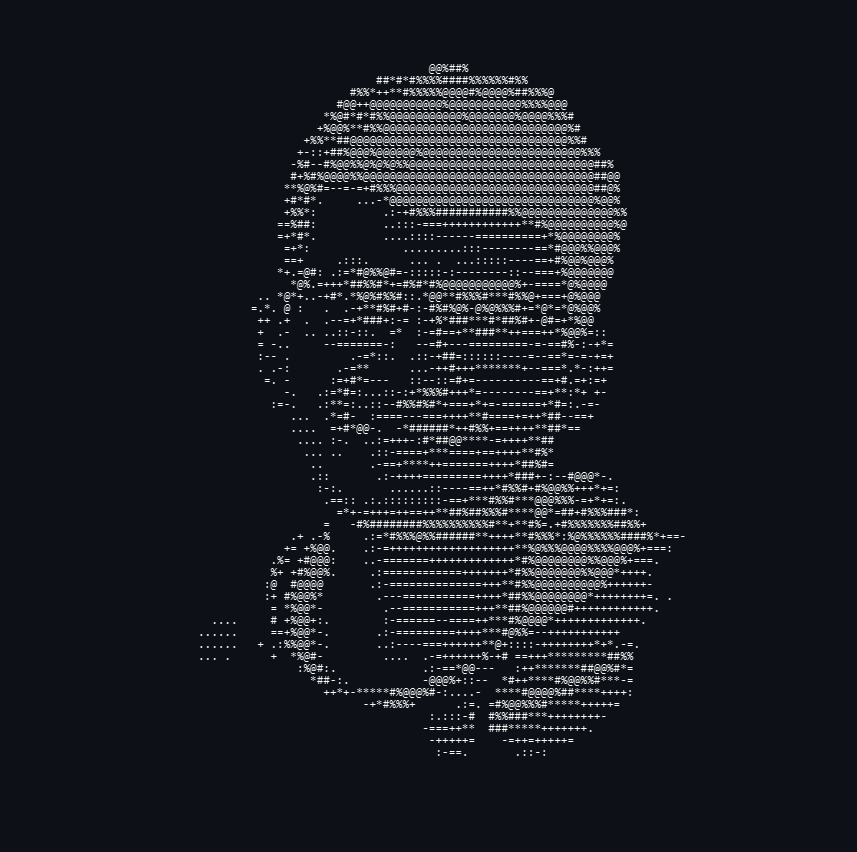

/////////////////////////////////////////////////////////////////////////


```zsh
> neofetch system-config
```


```csharp
p6s@archlinux
---------------
OS: Arch Linux x86_64 && Windows 11 Pro
Host: Inspiron 15-3567 && Asus TUF Gaming F17
CPU: Intel i3-6006U (4) @ 2.00 GHz && Intel(R) Core(TM) i5-12500H, 2.50 GHz
GPU: AMD ATI Radeon HD 8670A/8670M/8690M / R5 M33 && Nvidia GeForce RTX 3050 Mobile
Kernel: 6.9.1-arch1-1
Shell: bash 5.3.3
DE: Plasma 6.4.4
WM: kwin 
Terminal: Konsole
Font: Nerd Font
Editor: VSCode + Windsurf + Cursor
Languages: JavaScript, Python, C++
Frameworks: MERN, MEAN
Learning: MongoDB, PostgreSQL, Mysql
Projects: ERP, Image Research, IoT
```




```zsh
> neofetch Personal-Info
```


```csharp
Username:     P6s
Name:         Param Suthar
Location:     India
Timezone:     IST (UTC +5:30)
Pronouns:     he/him
Since:        2021
Hobbies:      Coding, Reading, Content Creation
```

```zsh
> neofetch Contact
```

```csharp
GitHub:       github.com/P6s-fx
Email:        param.corpid@gmail.com
Discord:      p6sfx
LinkedIn:     linkedin.com/in/paramsuthar
Website:      https://p6s.in
```
```zsh
> neofetch Learning
```

```csharp
Libraries:    Advanced Web Aminations, Python with AI-ML, BlockChain
Databases:    PostgreSQL, Mysql
Frameworks:   Next.js, Tailwind CSS
Tooling:      Docker, CI/CD, Linux internals

```
```zsh
> neofetch Stats
```

```csharp
Public Repos:    6+
Contributions:   0.05k+ commits
Stars:           5+
Followers:       1+
```
```zsh
> neofetch Toolchain
```

```csharp
Shell:          bash
Terminal:       Konsole
Editor:         VSCode + Windsurf + Cursor
Font:           Nerd Font
Color Scheme:   Gruvbox Dark
```
```zsh
> neofetch Projects
```

```csharp
• HRMS             → Employee management app built with React & Node
• Stock Screener   → Screener using fin APIs and D3.js
• Portfolio Web    → Built with Astro + Tailwind + Animations
• Image Dehazing   → Research Project
• Dynofox          → AI Automated Legal Document Generator
```
```zsh
> exit
```
