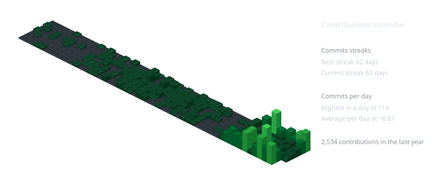

<br clear="left"/>

```zsh
[p6s@archlinux ~]$ fastfetch
```

<p align="center">
  
</p>

```zsh
[p6s@archlinux ~]$ cat ~/about.md
```

```csharp
Name:        Param Suthar  (P6s)
Role:        Full-stack developer · Tassos Consultancy
Based:       Ahmedabad, India · IST (UTC +5:30)
Pronouns:    he/him
Coding:      since 2021
Motto:       Zero To One ⚡
Focus:       Product-grade web, mobile & backend systems, end to end
Hobbies:     Coding, Reading, Content Creation, ricing Arch
```

```zsh
[p6s@archlinux ~]$ gh contributions --last-year
```

<p align="center">
  
</p>

```zsh
[p6s@archlinux ~]$ gh stats --rhythm
```

<p align="center">
  
</p>

<!--
  Isometric commit calendar, hidden for now. It is still regenerated by the
  Profile metrics workflow; move this block out of the comment to show it again.

<p align="center">
  
</p>
-->

```zsh
[p6s@archlinux ~]$ pacman -Qe --groups stack
```

<p align="center">
  
</p>

```zsh
[p6s@archlinux ~]$ tokei ~/github --sort code
```

<p align="center">
  
</p>

```zsh
[p6s@archlinux ~]$ ls -l ~/projects
```

```csharp
drwxr-xr-x  Dynofox          → AI-automated legal document generator
drwxr-xr-x  HRMS             → Employee management app, React & Node
drwxr-xr-x  Stock Screener   → Screener on financial APIs with D3.js charts
drwxr-xr-x  Image Dehazing   → Research: boundary constraint & contextual regularisation
drwxr-xr-x  Portfolio Web    → Astro + Tailwind + animations
drwxr-xr-x  p6s-ArchBash     → My Arch Linux bash setup
```

```zsh
[p6s@archlinux ~]$ cat ~/.config/learning
```

```csharp
Web:         Advanced web animations, Next.js internals
AI / ML:     Python for AI-ML, LLM tooling
Systems:     Linux internals, Docker, CI/CD pipelines
Also:        Blockchain
```

```zsh
[p6s@archlinux ~]$ cat ~/.config/contact
```

```csharp
GitHub:      github.com/P6s-fx
Email:       param.corpid@gmail.com
Discord:     p6sfx
LinkedIn:    linkedin.com/in/paramsuthar
Website:     https://p6s.in
```

```zsh
[p6s@archlinux ~]$ exit
```

<sub>Cards are drawn by <a href="./scripts/profile-stats.mjs"><code>scripts/profile-stats.mjs</code></a> from GitHub's own numbers and refreshed every 6 hours by the Profile metrics workflow.</sub>
